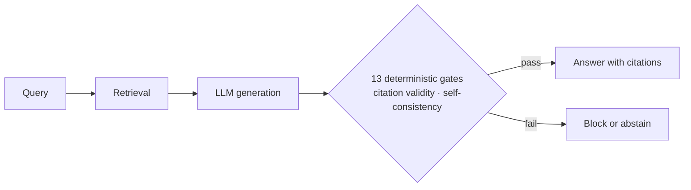

<h1 align="center">Ammar Ayaz</h1>

  <b>AI Engineer & NLP Researcher</b> 
  Trustworthy RAG · LLM Safety · Multi-Agent Systems

  <a href="mailto:ammarkhan9903233@gmail.com">Email</a> · <a href="https://linkedin.com/in/ammarkhan-tech">LinkedIn</a>

---

### 🎓 Education
**B.S. Computer Science (AI)**, University of Engineering & Technology Peshawar, expected 2026

### 🔬 Profile
- **Research focus:** Selective prediction and verification for retrieval-augmented generation in high-stakes domains.
- **Current work:** An abstention-aware, verifiable RAG system for Islamic finance compliance, grounded in AAOIFI standards.
- **Open to:** Graduate research (MS) · AI engineering roles.

### 🧠 About
Language models become fluent long before they become reliable. In financial compliance, a confident wrong answer, or an answer that leaks data across a permission boundary, is worse than no answer at all.

My work asks how far deterministic checks (citation verification, contradiction detection, access control) and selective prediction (knowing when to abstain) can push a RAG system toward trustworthiness. I test those claims with ablations and adversarial evaluation rather than demos.

### 🎯 Research Interests
- Selective prediction and abstention in retrieval-augmented generation.
- Verifiable, citation-grounded generation for regulated domains.
- Cross-lingual reliability: whether safety and compliance constraints survive in English–Arabic models.
- Security of enterprise RAG: authorization-aware retrieval and prompt-injection defense.

---

### 🏆 Flagship Research

#### Verifiable RAG with Selective Prediction for Islamic Finance Compliance (AAOIFI)
*Research in progress · Repository: [AAOIFI-RAG](https://github.com/ammarkhan081/AAOIFI-RAG)*

**Question.** Can a deterministic verification layer stop an LLM from returning uncited or self-contradictory compliance answers, and does that protection hold across languages?

**Design.** A 13-gate deterministic safety layer that intercepts citation failures and logical self-contradictions before an answer reaches the user.  
**Method.** A 2×2 ablation that isolates the effect of retrieval.  
**Preliminary findings.** (evaluation set: 32 clause-grounded questions). Jais-2, a bilingual model, showed cross-lingual leakage under strict English-language compliance instructions. Qwen-2.5 passed every gate check. Gate compliance measures mechanical safety, not answer correctness.

---

### 💻 Selected Projects

#### [Secure Role-Based AI Assistant for Enterprise Finance](https://github.com/ammarkhan081/RBAC-Project)
*Hackathon team project (Pak Angels Generative AI Cohort 11), led by me.*  
An authorization-native assistant where access control is enforced before the model sees anything.
- **Query security:** generated SQL is parsed into an abstract syntax tree (`sqlglot`) and checked against role-permitted, column-masked views before execution. A dual-gate sanitizer screens prompt injection, and an audit ledger records every query and blocked attempt.
- **Hybrid routing:** a three-way router (SQL, RAG, hybrid) with citations to the underlying DuckDB views or document sections.
- **Evaluation:** in a 42-vector internal red-team suite, all 42 attacks were blocked; the benchmark recorded 0% cross-role leakage. 93 automated tests pass.

`FastAPI` `DuckDB` `sqlglot` `FastEmbed` `FlashRank` `Next.js`

#### [AI Research Analyst: Agentic Corrective RAG](https://github.com/ammarkhan081/ai-research-analyst)
*A cyclic LangGraph agent that answers questions over a private corpus and grades its own evidence.*
- **Retrieval:** BM25 and dense BGE embeddings fused with RRF, then cross-encoder reranking.
- **Correction:** a router chooses between direct answer, retrieval, and web search (Tavily). Retrieved documents are graded (CRAG), and a Self-RAG check forces regeneration when the answer is ungrounded.
- **Traceability:** every request produces a redacted, structured step trace. Tools are also exposed through an MCP server.

`LangGraph` `ChromaDB` `BGE` `Tavily` `MCP` `RAGAS` `FastAPI`

#### [Sovereign On-Premises Finance Assistant](https://github.com/ammarkhan081/Finance-Sovereign-Assistant)
*A privacy-first financial assistant that makes no external API calls.*
- **Model:** QLoRA-fine-tuned Mistral 7B served locally through Ollama.
- **Retrieval:** a four-stage hybrid pipeline (BM25, dense BGE, RRF fusion, cross-encoder reranking).

`QLoRA` `Ollama` `Mistral 7B`

#### [ASHIA: Agentic AIOps Self-Healing Infrastructure](https://github.com/ammarkhan081/Agentic-AIOps-Platform-Self-Healing-Infrastructure-Agent)
*A six-agent LangGraph pipeline across 11 containerized services.*
- **Detection:** Z-score analysis over 12 Prometheus metrics, polled every 30 seconds, requiring three consecutive anomalous readings to reduce false positives.
- **Diagnosis and action:** root-cause analysis correlates Loki logs, Jaeger traces, and ChromaDB incident memory. Low-risk fixes run automatically; medium and high-risk fixes wait for human approval.

`LangGraph` `FastAPI` `Prometheus` `Loki` `Jaeger` `ChromaDB` `Docker Compose`

---

### ⚙️ Technical Skills
- **LLMs & NLP:** PyTorch · Hugging Face · QLoRA · Prompt engineering · RAGAS
- **Agents & Retrieval:** LangGraph · MCP · Hybrid retrieval (BM25 + dense, RRF) · Cross-encoder reranking
- **Vector & Data Stores:** ChromaDB · FAISS · Pinecone · DuckDB
- **Engineering:** Python · TypeScript · FastAPI · Next.js · Docker · Kubernetes · OpenTelemetry
